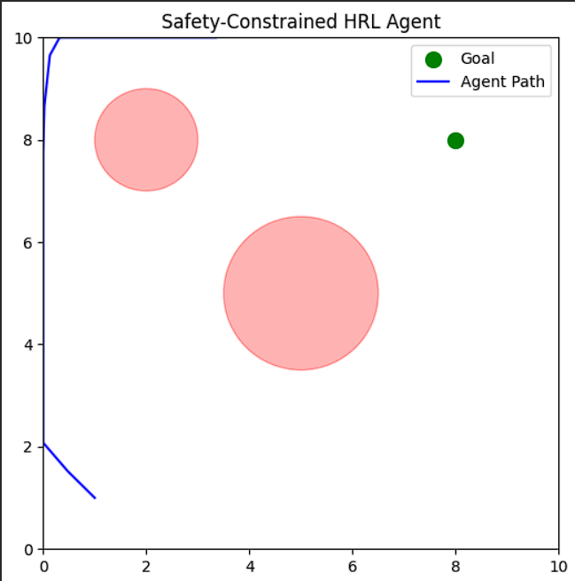

# Safety-Constrained Hierarchical RL with Human Preference Feedback (RLHF)

A PyTorch implementation of a Hierarchical Reinforcement Learning (HRL) agent that navigates complex environments while adhering to strict safety constraints. This project integrates Constrained Markov Decision Processes (CMDPs) via Lagrangian Relaxation and aligns agent behavior using Reinforcement Learning from Human Feedback (RLHF).

## Abstract

Standard Reinforcement Learning agents often maximize reward at the cost of safety. This project addresses safe autonomous navigation by combining three advanced paradigms:

1. **Hierarchical Control**: A Manager-Worker architecture decomposes the long-horizon navigation task into sub-goals.
2. **Safety Constraints**: Hard constraints (e.g., "avoid hazard zones") are enforced using Lagrangian Relaxation, converting the problem into a dual-primal optimization.
3. **Preference Learning (RLHF)**: Instead of manually engineering scalar rewards, a Reward Model is trained on (simulated) human preferences to guide the agent towards qualitatively "safer" trajectories.

## Key Features

- **Hierarchical Architecture**: Manager network (high-level policy) and Worker network (low-level control)
- **Lagrangian Safety Layer**: Dynamic λ multiplier that adapts penalties based on constraint violation history
- **RLHF Integration**: Includes a separate Reward Model network trained to predict human preference scores
- **Custom Gymnasium Environment**: A continuous 2D navigation task with dynamic hazard zones and sparse rewards
- **GPU Accelerated**: Fully optimized for CUDA training (T4/A100)

## Project Structure

```
safety-hrl-rlhf/
├── env.py              # Custom Gymnasium Environment (CMDP formulation)
├── models.py           # PyTorch definitions for Agent, Manager, Worker, & Reward Model
├── train.py            # Main training loop (PPO-style update + Lagrangian dual ascent)
├── requirements.txt    # Python dependencies
└── README.md           # Documentation
```

## Installation

1. Clone the repository:

```bash
git clone https://github.com/your-username/safety-hrl-rlhf.git
cd safety-hrl-rlhf
```

2. Install dependencies:

```bash
pip install -r requirements.txt
```

## Usage

To train the agent from scratch using the default hyperparameters:

```bash
python train.py
```

The script will:

1. Initialize the SafetyNavEnv
2. Pre-load the Reward Model (simulated)
3. Train the HRL Agent for 1,000 episodes
4. Log the Reward, Safety Cost, and Lagrangian Multiplier (λ) to the console

## Theory & Mathematics

### The Lagrangian Objective

We formulate the problem as a Constrained MDP. We aim to maximize expected return J_R(π) subject to cost J_C(π) ≤ δ. We solve this by optimizing the Lagrangian:

```
min_θ max_λ≥0 L(θ,λ) = J_R(π_θ) - λ(J_C(π_θ) - δ)
```

If the agent violates safety constraints (J_C > δ), λ increases, heavily penalizing unsafe actions in subsequent updates.

### RLHF Reward Modeling

The reward signal r(s,a) is not hand-coded but predicted by a neural network r̂_ϕ. This network is trained to minimize the cross-entropy loss between predicted preference probabilities and human labels (simulated via a synthetic oracle in this codebase).

## Results

**


- **Convergence**: The agent typically learns to reach the target within 400-500 episodes
- **Safety**: The Lagrangian multiplier successfully forces the agent to skirt around hazard zones rather than passing through them

## Contributing

Open to contributions! Please submit a Pull Request if you'd like to improve the RLHF oracle simulation or add more complex maze environments.

## License

This project is licensed under the MIT License.